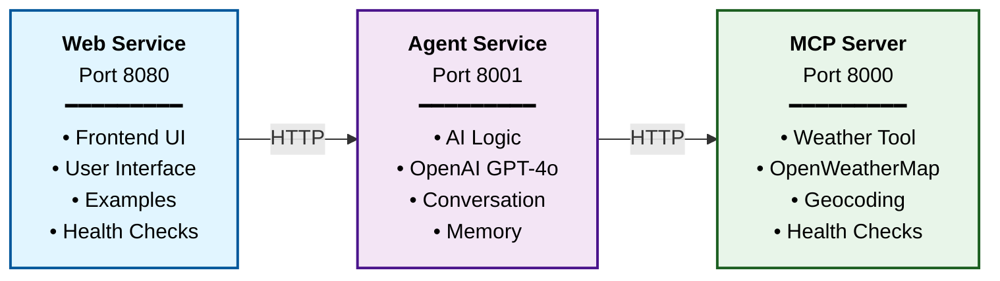
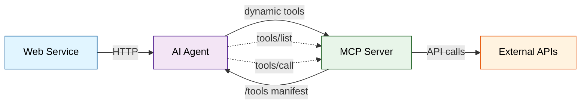

# MCP Travel Weather Server - LAB03

## Dokumentasjon

**[Presentasjon](./doc/ws-pres.md)** - Marp presentation markdown

## Oversikt

**MCP Travel Weather Server** er en basis-implementasjon for MCP workshop LAB03. Dette er en **læringsorientert versjon** som demonstrerer Model Context Protocol (MCP) grunnleggende konsepter med fokus på værdata.

**Arkitektur**: Systemet består av tre hovedkomponenter:
- **Web Service**: Frontend brukergrensesnitt
- **AI Agent**: OpenAI-basert agent som orkestrerer forespørsler
- **MCP Server**: HTTP API med værfunksjonalitet

## ✅ MCP 2025-11-25 Kompatibel Implementasjon

Denne workshopen implementerer **JSON-RPC 2.0 over HTTP** i henhold til den offisielle MCP spesifikasjonen (2025-11-25).

**Offisielle MCP 2025-11-25 Transporter:**
1. **stdio** - JSON-RPC 2.0 over standard input/output
2. **Streamable HTTP** - JSON-RPC 2.0 over HTTP POST med valgfri Server-Sent Events (SSE)

**Vår Implementasjon:**
- ✅ JSON-RPC 2.0 protokoll
- ✅ POST /message endpoint for alle operasjoner
- ✅ tools/list metode for verktøyoppdagelse
- ✅ tools/call metode for verktøykjøring
- ✅ Standard JSON-RPC feilkoder
- ✅ MCP-compliant tool result format (content, structuredContent, isError)
- ✅ MCP tools manifest struktur

**Hvorfor Denne Tilnærmingen?**
- ✅ Spec-kompatibel og produksjonsklar
- ✅ Lærer den faktiske MCP-protokollen
- ✅ Enkelt å teste med curl (bare JSON)
- ✅ Ingen migrering nødvendig for produksjon
- ✅ Tydelig protokollstruktur

**Hva Som Er Valgfritt (Ikke Implementert):**
- ⚪ stdio transport (kun HTTP i denne workshopen)
- ⚪ Server-Sent Events streaming
- ⚪ WebSocket transport
- ⚪ MCP SDK wrappere (bruker direkte JSON-RPC for læring)

Dette er en produksjonsklar implementasjon som følger MCP-spesifikasjonen fullstendig.

## Workshop Arkitektur (LAB03)

### Forenklet tjenestearkitektur


### 1. MCP Server (`services/mcp-server/`)
**MCP-compliant JSON-RPC 2.0 API** - Port 8000
- `POST /message` - JSON-RPC 2.0 endpoint for alle operasjoner
  - `tools/list` metode - Hent verktøymanifest
  - `tools/call` metode - Kjør verktøy
- `GET /health` - Helsesjekk

**MCP Tools Manifest:**
Serveren følger [MCP spesifikasjonen](https://modelcontextprotocol.io/specification/2025-11-25/server/tools) og eksponerer verktøy med:
- `name`: Unikt verktøynavn
- `title`: Human-readable visningsnavn
- `description`: Funksjonalitetsbeskrivelse
- `inputSchema`: JSON Schema for input validering
- `outputSchema`: JSON Schema for output validering
- `endpoint`: HTTP endpoint for verktøyet
- `method`: HTTP metode (GET, POST, etc.)

**MCP Result Format:**
Alle verktøy returnerer MCP-compliant responses:
```json
{
  "content": [{"type": "text", "text": "..."}],
  "structuredContent": {...},
  "isError": false
}
```

**API som brukes:**
- **OpenWeatherMap** for værdata
- **Nominatim** (OpenStreetMap) for geocoding

### 2. Agent Service (`services/agent/`)
**AI-orkestrering med MCP-compliant tool handling** - Port 8001
- OpenAI GPT-4o mini for intelligent respons
- Dynamisk lasting av verktøy fra MCP server ved oppstart
- MCP-compliant response parsing (content array, structuredContent, isError)
- HTTP klient med endpoint mapping fra tools manifest
- Persistent SQLite database for samtalehistorikk
- `POST /query` - Prosesser brukerforespørsler
- `GET /health` - Helsesjekk med agent status

### 3. Web Service (`services/web/`)
**Frontend web-grensesnitt** - Port 8080
- HTML/JavaScript grensesnitt
- HTTP klient for agent kommunikasjon
- Eksempel spørsmål og interaktiv chat
- Real-time helsestatusindikator
- `GET /` - Hovedside
- `POST /query` - Proxy til agent service
- `GET /examples` - Foreslåtte spørsmål
- `GET /health` - Helsesjekk

### 4. Datasette (`datasette`)
**SQLite database viewer** - Port 8090
- Web-basert SQLite database viewer for samtalehistorikk
- Read-only tilgang til conversations database
- Visuell inspeksjon av conversation og session data
- Automatisk tilkobling til `/data/conversations.db`
- Verktøy for å utforske agent hukommelse

## Workshop Læringsmål

Denne LAB03-versjonen er designet for å lære:
- **MCP Protocol**: Implementering av Model Context Protocol (spec 2025-11-25)
- **MCP Tools**: Verktøydefinisjon med inputSchema og outputSchema
- **MCP Results**: Strukturerte responses med content array og structuredContent
- **Tools Integration**: Dynamisk kobling av AI agent med MCP server verktøy
- **OpenAI Function Calling**: Strukturert verktøybruk med dynamic tool loading
- **Docker Deployment**: Containerisert mikroservice deployment
- **Error Handling**: MCP-compliant error responses med isError flag

## MCP Spec Compliance Proof

**Third-Party MCP Client** (`services/mcp-sdk-client/`) - En frittstående Python klient som beviser at MCP serveren følger den offisielle spesifikasjonen:

- ✅ **Uavhengig implementasjon** - Ingen delt kode med workshop agenten
- ✅ **Ren JSON-RPC 2.0** - Ingen proprietære protokoll-utvidelser
- ✅ **Minimal avhengigheter** - Kun httpx library
- ✅ **Fungerer med hvilken som helst MCP server** - Oppdager verktøy dynamisk
- ✅ **Docker Ready** - Kjører i Docker container med fulle tjenesteintegrert

**Test det (Docker - Anbefalt):**
```bash
# Med hele stacken
docker compose --profile compliance-test up mcp-sdk-client

# Eller som en one-off test
docker compose --profile compliance-test run mcp-sdk-client
```

**Test det (Lokalt):**
```bash
cd services/mcp-sdk-client
export MCP_SERVER_URL=http://localhost:8000  # For lokal testing
python3 test_mcp_sdk.py
```

Se [MCP SDK Client README](services/mcp-sdk-client/README.md) for detaljer.

## Kom i gang

### Forutsetninger
Du trenger API nøkler for:
- **OpenAI**: For GPT AI → [platform.openai.com](https://platform.openai.com/)
- **OpenWeatherMap**: For værdata → [openweathermap.org/api](https://openweathermap.org/api)

### Docker Deployment (Anbefalt)
```bash
# Klon repository
git clone <repository-url>
cd agent

# Sett opp miljøvariabler
cp .env.example .env
# Rediger .env med dine API nøkler

# Start alle tjenester (uten compliance test)
docker compose up -d

# Start alle tjenester INKL. MCP SDK compliance test
docker compose --profile compliance-test up -d

# Sjekk status
docker compose ps
```

**Tilgang:**
- **Hovedside**: http://localhost:8080
- **Agent API**: http://localhost:8001
- **MCP API**: http://localhost:8000
- **Datasette (Database Viewer)**: http://localhost:8090

**Kjør MCP Compliance Test:**
```bash
# Se loggen fra compliance test
docker compose logs mcp-sdk-client

# Kjør testen på nytt
docker compose --profile compliance-test run mcp-sdk-client
```

### Miljøvariabler
```bash
# Kreves for LAB03
OPENAI_API_KEY=your_openai_api_key_here
OPENWEATHER_API_KEY=your_openweather_api_key_here  

# Service URLs (auto-konfigurert i Docker)
MCP_SERVER_URL=http://mcp-server:8000
```

## Funksjoner (LAB03)

### MCP-Compliant Tools Discovery
- MCP server eksponerer tilgjengelige verktøy via `/tools` endpoint
- Agent laster verktøy dynamisk ved oppstart
- Følger [MCP spesifikasjon 2025-11-25](https://modelcontextprotocol.io/specification/2025-11-25/server/tools)
- Tools returnerer strukturerte responses med `content`, `structuredContent` og `isError`
- Støtte for inputSchema og outputSchema validering

### Værprognose
- Detaljert værprognose for enhver destinasjon
- Temperatur, nedbør, vind og luftfuktighet
- Basert på OpenWeatherMap API

### MCP Verktøy
- **get_weather_forecast**: Hent værprognose for destinasjoner
- **ping**: Test verktøy for tilkoblingskontroll
- **get_status**: Server status informasjon
- Alle verktøy følger MCP spesifikasjon

### Persistent Hukommelse
- Husker samtalehistorikk på tvers av sesjoner
- SQLite database for lokal lagring
- Administrering av flere samtalesesjoner

### Intelligent Dialog
- OpenAI GPT-4o mini for naturlig språkforståelse
- Dynamic function calling basert på MCP tools manifest
- Kontekstbevisst samtaler

## MCP Arkitektur

Workshop LAB03 demonstrerer MCP (Model Context Protocol) arkitektur med dynamisk tools discovery:



**Arkitektur komponenter:**
- **Web Service**: Frontend brukergrensesnitt og API proxy
- **AI Agent**: OpenAI GPT-4o mini med dynamisk tools loading og intelligent endpoint mapping
- **MCP Server**: HTTP API som eksponerer MCP tools manifest og implementerer verktøy
- **Tools Manifest**: MCP-kompatibel manifest med endpoint og method informasjon
- **Memory**: Persistent samtalehukommelse

**MCP Protocol Implementation:**
- MCP server følger MCP spesifikasjon for tools eksponering
- Agent implementerer dynamisk tools discovery ved oppstart
- Intelligent endpoint mapping med både eksplisitt og konvensjonsbasert støtte
- HTTP method routing (GET, POST, PUT, DELETE) basert på tools manifest

### Python Avhengigheter (hvis ikke bruker Docker)
```bash
pip install -r requirements.txt
```

## Docker Deployment (Anbefalt)

Systemet er optimalisert for Docker deployment med alle komponenter i separate containere.

### Forutsetninger
- Docker og Docker Compose installert
- API nøkler konfigurert (se over)

### Rask start
```bash
# Klon repository og naviger til mappen
cd travel-weather-mcp

# Kopier og rediger miljøvariabler
cp .env.example .env
# Rediger .env med dine API nøkler:
# - OPENAI_API_KEY (kreves)
# - OPENWEATHER_API_KEY (kreves)

# Bygg og start alle tjenester
docker compose up -d

# Sjekk at alt kjører
docker compose ps
```

### Tjenester som startes
- **travel-weather-mcp-server**: MCP server med værverktøy
- **travel-weather-agent**: AI agent service
- **travel-weather-web**: Web interface på http://localhost:8080

### Bruk av tjenestene

#### Web Interface
Åpne http://localhost:8080 i nettleseren for enkel bruk.

#### API Tilgang
```bash
# REST API kall
curl -X POST http://localhost:8080/query \
  -H "Content-Type: application/json" \
  -d '{"query": "Hvordan er været i Oslo i dag?"}'
```

### Manuell Docker start
```bash
# Bygg og start alle tjenester
docker compose up -d

# Eller start kun spesifikke tjenester
docker compose up -d mcp-server travel-agent

# Se logfiler
docker compose logs -f mcp-server
docker compose logs -f travel-agent

# Stopp tjenester
docker compose down
```

### Tilgjengelige tjenester
- **Web Interface**: http://localhost:8080 - Enkel web-grensesnitt for agenten
- **Agent API**: http://localhost:8001 - REST API for agenten
- **MCP Server**: http://localhost:8000 - MCP server API
- **Datasette**: http://localhost:8090 - SQLite database viewer for samtalehistorikk
- **MCP SDK Client (optional)**: Compliance test - kjøres med `--profile compliance-test`

## Bruk

### Web Interface (Anbefalt)
Gå til http://localhost:8080 i nettleseren din for et enkelt brukergrensesnitt.

### Docker Commands
```bash
# Se alle kjørende tjenester
docker compose ps

# Restart spesifikk tjeneste
docker compose restart mcp-server

# Se logfiler live
docker compose logs -f travel-agent
```

## API Endpoints (LAB03)

### MCP JSON-RPC 2.0 Protocol
MCP Server bruker JSON-RPC 2.0 protokoll via `POST /message` endpoint for alle operasjoner:

- **POST /message** - JSON-RPC 2.0 endpoint for alle MCP operasjoner
  - `tools/list` metode - Hent liste over tilgjengelige verktøy
  - `tools/call` metode - Kjør et spesifikt verktøy
- **GET /health** - Helsesjekk

### JSON-RPC 2.0 Request Format
```json
{
  "jsonrpc": "2.0",
  "id": 1,
  "method": "tools/list",
  "params": {}
}
```

### Tilgjengelige MCP Verktøy

#### get_weather_forecast
- **Beskrivelse**: Hent værprognose for en destinasjon
- **Parametere**: `location` (stedsnavn, f.eks. "Oslo, Norway")
- **Returner**: Værprognose med temperatur, vind, fuktighet og beskrivelse

#### ping
- **Beskrivelse**: Test verktøy for tilkoblingskontroll
- **Parametere**: `message` (melding å sende)
- **Returner**: Bekreftelses-melding

### Eksempel API Kall (JSON-RPC 2.0)

**Hent verktøyliste:**
```bash
curl -X POST http://localhost:8000/message \
  -H "Content-Type: application/json" \
  -d '{
    "jsonrpc": "2.0",
    "id": 1,
    "method": "tools/list"
  }'
```

**Kall værverktøy:**
```bash
curl -X POST http://localhost:8000/message \
  -H "Content-Type: application/json" \
  -d '{
    "jsonrpc": "2.0",
    "id": 2,
    "method": "tools/call",
    "params": {
      "name": "get_weather_forecast",
      "arguments": {"location": "Oslo, Norway"}
    }
  }'
```

**Kall ping verktøy:**
```bash
curl -X POST http://localhost:8000/message \
  -H "Content-Type: application/json" \
  -d '{
    "jsonrpc": "2.0",
    "id": 3,
    "method": "tools/call",
    "params": {
      "name": "ping",
      "arguments": {"message": "Hello MCP"}
    }
  }'
```

**Via Agent (anbefalt for brukere):**
```bash
curl -X POST http://localhost:8001/query \
  -H "Content-Type: application/json" \
  -d '{"query": "Hvordan er været i Oslo?"}'
```

## Sikkerhet

- API nøkler lagres som miljøvariabler
- Ingen sensitive data logges
- Input validering på alle endpoints
- Rate limiting gjennom OpenWeatherMap API

## Feilsøking

### Vanlige problemer

1. **"API key not configured"**
   - Sjekk at miljøvariabler er riktig satt i `.env`
   - Verifiser at API nøklene er gyldige

2. **"Location not found"**
   - Prøv mer spesifikke stedsnavn
   - Inkluder land (f.eks. "Oslo, Norway")

3. **Containerproblemer**
   - Kjør `docker compose down && docker compose up -d`
   - Sjekk logfiler med `docker compose logs`

### Logging
```bash
# Se live logfiler (stdout/stderr)
docker compose logs -f travel-agent   # Agent service
docker compose logs -f mcp-server      # MCP server
docker compose logs -f agent-web       # Web service
docker compose logs -f                 # Alle tjenester

# Tilgang til persistente loggfiler i volume
docker exec travel-weather-agent cat /app/logs/agent.log
docker exec travel-weather-mcp cat /app/logs/mcp-server.log
docker exec travel-weather-web cat /app/logs/web.log

# Følg loggfiler i real-time
docker exec travel-weather-agent tail -f /app/logs/agent.log
```

**Logglagring**: Alle tjenester lagrer logger i `travel-weather-logs` Docker volume på `/app/logs/` inne i hver container. Logger skrives både til stdout (for `docker logs`) og til persistente filer.

## Workshop Utvidelser

LAB03 er designet for utvidelse. Deltagere kan legge til:

### Nye MCP verktøy
1. Implementer en ny funksjon i `services/mcp-server/app.py`
2. Legg verktøyet til i `handle_tools_list()` med navn, beskrivelse og inputSchema
3. Legg til handling for verktøyet i `handle_tools_call()` metoden
4. Agent vil automatisk laste det nye verktøyet ved restart via `tools/list` JSON-RPC metoden
5. Test med curl eller web interface

**Merk**: Agent laster verktøy dynamisk via JSON-RPC `tools/list`, så ingen hardkoding kreves i agent koden.

### Foreslåtte utvidelser
- **Ruteplanlegging**: Legg til OpenRouteService API
- **Hotell booking**: Integrer booking API
- **Transport**: Legg til public transport API
- **Oversettelse**: Legg til språkoversettelse

Se [Presentasjonen](./doc/ws-pres.md) for detaljerte instruksjoner på workshop øvelser.

## Testing

### Manual JSON-RPC 2.0 Testing
```bash
# Test health endpoints
curl http://localhost:8000/health
curl http://localhost:8001/health
curl http://localhost:8080/health

# Test MCP tools/list metode
curl -X POST http://localhost:8000/message \
  -H "Content-Type: application/json" \
  -d '{
    "jsonrpc": "2.0",
    "id": 1,
    "method": "tools/list"
  }' | python3 -m json.tool

# Test get_weather_forecast verktøy
curl -X POST http://localhost:8000/message \
  -H "Content-Type: application/json" \
  -d '{
    "jsonrpc": "2.0",
    "id": 2,
    "method": "tools/call",
    "params": {
      "name": "get_weather_forecast",
      "arguments": {"location": "Oslo, Norway"}
    }
  }' | python3 -m json.tool

# Test ping verktøy
curl -X POST http://localhost:8000/message \
  -H "Content-Type: application/json" \
  -d '{
    "jsonrpc": "2.0",
    "id": 3,
    "method": "tools/call",
    "params": {
      "name": "ping",
      "arguments": {"message": "test"}
    }
  }' | python3 -m json.tool

# Test via Agent
curl -X POST http://localhost:8001/query \
  -H "Content-Type: application/json" \
  -d '{"query": "Hva er været i Oslo?}' | python3 -m json.tool
```

## Lisens

MIT License - se LICENSE fil for detaljer.

## Workshop Dokumentasjon

For workshop deltagere:
- **Presentasjon**: [Marp Presentation](./doc/ws-pres.md)
- **Teknisk support**: Spør workshopleder

## Bidrag

Bidrag er velkomne! Vennligst:
1. Fork repository
2. Opprett en feature branch
3. Commit endringene dine
4. Push til branch
5. Opprett en Pull Request